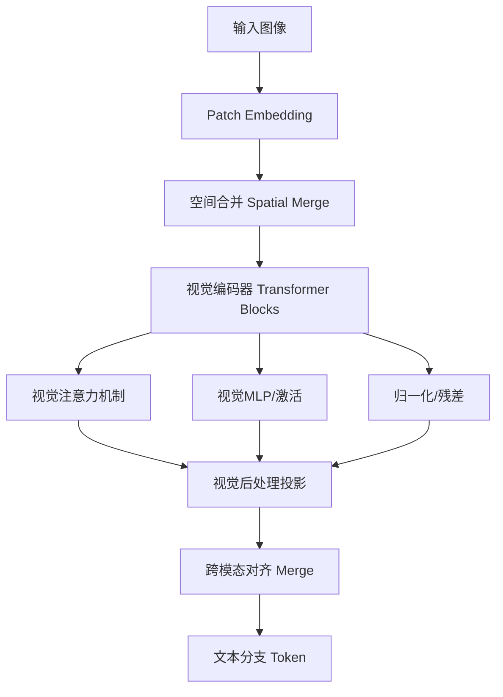

# Vision Encoder 逻辑与跨模态对齐

## 1. 视觉处理流程

## 2. 视觉编码器主要步骤

- **Patch Embedding**：将输入图像分割为多个patch，每个patch通过线性投影或卷积映射到高维空间。
- **空间合并（Spatial Merge）**：将patch合并，减少token数量，提升效率。
- **视觉编码器（Transformer Blocks）**：多层Transformer结构，包含Q/K/V投影、注意力、MLP、归一化、残差连接。
- **视觉注意力机制**：对合并后的token进行自注意力计算，支持Flash Attention加速。
- **归一化与残差**：每个Transformer块包含LayerNorm和残差加法。
- **视觉MLP/激活**：如Swish/SwiGLU激活函数。
- **视觉后处理投影**：将视觉编码器输出投影到与文本分支对齐的空间。

## 3. 跨模态对齐（Merge）

- 视觉编码器输出经过投影层与文本token对齐。
- 多模态统计：
    - **TTFT（首token时间）**：视觉分支+文本prefill分支的计算量和内存占用。
    - **TPOT（每token时间）**：文本decode分支的计算量和内存占用。
- 内存统计：权重相加，临时激活值取最大值，KV缓存取文本分支。

## 4. 总结

视觉处理流程包括patch embedding、空间合并、多层Transformer编码、注意力、归一化、残差、激活、后处理投影，最终与文本分支token对齐，实现跨模态融合。

---

如需更详细的代码示例或流程图，可进一步补充。